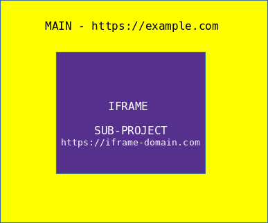

# Surf Me
The in-browser page runner.

[](https://www.jsdelivr.com/package/npm/@dscribers/surf-me)

## Usage

1. Include the script on every page that needs to be tested.

```html
<script href="https://cdn.jsdelivr.net/npm/@dscribers/surf-me@latest/dist/surf-me.min.js"></script>
<script>
  SurfMe(
    'https://example.com', // Allowed origin to communicate with web page. * means all/any origin.
    {
      // Configuration to be sent to the origin
    }
  )
</script>
```

2. Follow the instructions of the parent/origin app.

## How it works



1. A main project creates a page with an iframe
2. A sub-project creates a page or pages with [the above script](#usage)
3. The main project loads the sub-project in the iframe
4. The main project sends [commands](#commands) to the iframe
5. SurfMe receives the commands and executes them on the iframe

## Commands

The following commands are available for execution on the iframe page:

Method | Params | Description
-------|--------|------------
checkAttrContains | (string) selector, (string) attribute, (string) text | Called to check if an element's attributes contains the given text
checkAttrIs | (string) selector, (string) attribute, (string) text | Called to check if an element's attribute is the same as the given text
checkExists | (string) selector | Called to check if an element exists on the page
checkIsOn | (string) url | Called to check if the page is on the given url
checkElementIs | (string) selector, (string) display | Called to check if an element is either visible or hidden
checkPageContains | (string) selector, (string) text | Called to check if the page contains the given text and the text is visible
checkTextContains | (string) selector, (string) text | Called to check if the element's text contains the given text
checkTextIs | (string) selector, (string) text | Called to check if element's text is matches the given text
checkValueContains | (string) selector, (string) text | Called to check if the element's value contains the given text
checkValueIs | (string) selector, (string) text | Called to check if the element's value matches the given text
doClick | (string) selector | Called to click on an element
doGoto | (string) url | Called to go to a url
doRefresh | - | Called to refresh the page
doSelect | (string) selector, (string) value | Called to select the given value in the given dropdown/select element.
doSet | (string) selector, (string) value | Called to set the given value into the element.
doSubmitForm | (string) selector | Called to submit the form with the given selector
doType | (string) selector, (string) str, (integer) speed | Called to type the given string in the given element at the given speed.

### Example

```javascript
  // page on https://example.com
  const action = 'doType';
  const params = ['#some-element-selector', 300]
  const iframeDomain = 'https://iframe-domain.com'

  iframe.contentWindow.postMessage({ action, params }, iframeDomain)

  // page on https://iframe-domain.com
  <script href="https://cdn.jsdelivr.net/npm/@dscribers/surf-me@latest/dist/surf-me.min.js"></script>
  <script>
    SurfMe('https://example.com')
  </script>
```